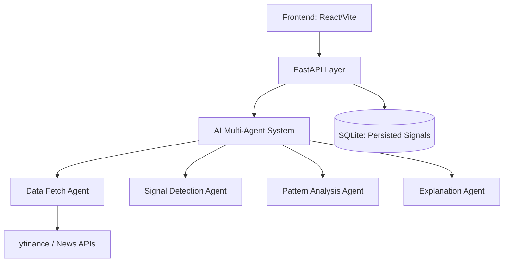

# StockINtel: AI-Powered Decision Intelligence for Indian Investors

## 🚀 Overview
**StockINtel** is a production-grade investment intelligence system designed for retail investors in India. It transforms raw financial data into clear, actionable signals using a multi-agent AI architecture, prioritizing explainable reasoning over generic data points.

Unlike traditional tools, StockINtel focuses on **signal detection**, **contextual reasoning**, and **portfolio-aware insights**.

---

## 🏗️ System Architecture
StockINtel uses a modular, multi-agent approach to process market data:

1.  **Opportunity Radar (Signal Engine)**: Detects breakouts, volume spikes, and unusual activity.
2.  **Chart Pattern Intelligence**: Automates technical analysis (Support/Resistance, RSI, etc.).
3.  **AI Explanation Engine**: Converts raw signals into human-readable, investor-friendly reasoning.



---

## 🛠️ Technology Stack
- **Backend**: Python, FastAPI, SQLite
- **Frontend**: React (Vite), TailwindCSS, Recharts, Lucide Icons
- **Data Providers**: yfinance (Market Data), NewsAPI (Sentiment)
- **AI/ML Layer**: Custom Agent-based pipeline for contextual reasoning

---
4. Agent Architecture
The system uses a multi-agent design where each agent performs a specialized task.
DataFetchAgent
Retrieves stock data from NSE or fallback providers
Normalizes OHLCV data
Applies validation checks
SignalAgent
Detects:
Volume spikes
Momentum
Trend signals
Outputs signal type and confidence contribution
PatternAgent
Identifies:
Breakouts
Support and resistance levels
RSI conditions
Enhances signal reliability
ExplanationAgent
Generates human-readable insights using LLM
Outputs:
Explanation
Reasoning
Risk
Insight
Portfolio context
Includes: - Strict JSON schema enforcement - Deterministic output (temperature = 0, fixed seed) -
Fallback logic if LLM fails
5. Tool Integrations
Market Data
NSE-based provider (primary)
Fallback providers (e.g., yfinance)
Includes validation layer to ensure data quality

LLM Integration
Used in ExplanationAgent
Generates plain-English explanations and insights
Controlled via structured prompts and schema validation
Persistence Layer (SQLite)
Stores: - Analysis history - Alerts lifecycle - Portfolio data
6. Communication Flow
DataFetchAgent → SignalAgent → PatternAgent → ExplanationAgent
Each agent: - Receives structured input - Returns structured output - Remains independent and
stateless
This ensures modularity, easy debugging, and scalability.

## 🚀 Setup Instructions

### 1. Prerequisites
- **Python 3.10+** (Backend)
- **Node.js 18+** (Frontend)
- **npm** (Node Package Manager)

### 2. Backend Setup
1.  **Navigate to the project root** and create a virtual environment:
    ```bash
    python -m venv .venv
    # On Windows:
    .venv\Scripts\activate
    # On macOS/Linux:
    source .venv/bin/activate
    ```
2.  **Install dependencies**:
    ```bash
    pip install -r requirements.txt
    ```
3.  **Configure Environment**:
    ```bash
    cp .env.example .env
    # Edit .env to set your preferred providers and API keys
    ```
4.  **Run the Server**:
    ```bash
    uvicorn backend.main:app --reload
    ```
    *The API will be available at `http://localhost:8000`.*

### 3. Frontend Setup
1.  **Navigate to the frontend directory**:
    ```bash
    cd frontend
    ```
2.  **Install dependencies**:
    ```bash
    npm install
    ```
3.  **Launch the Development Server**:
    ```bash
    npm run dev
    ```
    *The UI will be available at `http://localhost:5173`.*

---

## 📝 Key API Endpoints
- `GET /health`: Monitor system status.
- `POST /analyze`: Trigger a full-pipeline analysis for a specific stock (e.g., `RELIANCE.NS`).
- `GET /analyses`: View history of generated insights.
- `GET /alerts`: Access actionable open alerts.
- `GET /context`: Inspect the prompt and constraint logic currently in use.

---

## 🐳 Docker Deployment
You can also run the backend using Docker:
```bash
docker build -t stock-intel .
docker run -p 8000:8000 --env-file .env.example stock-intel
```

---
Built with ❤️ for the Indian Investor Community.
